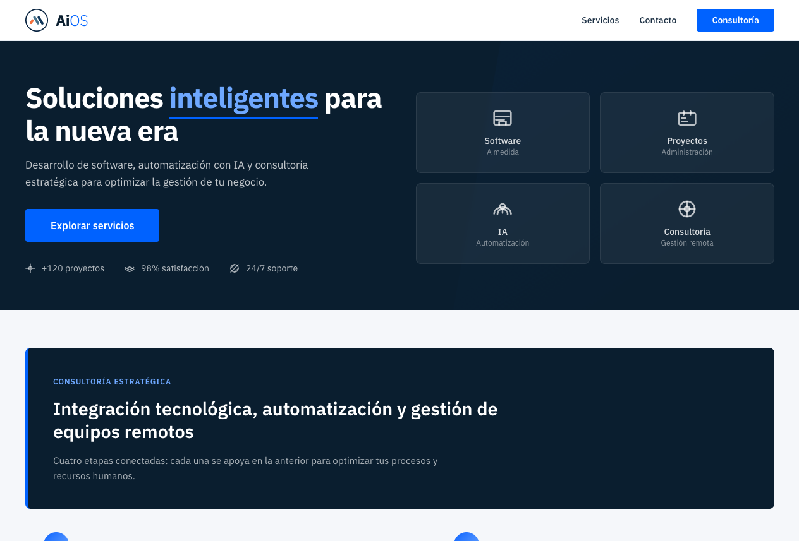
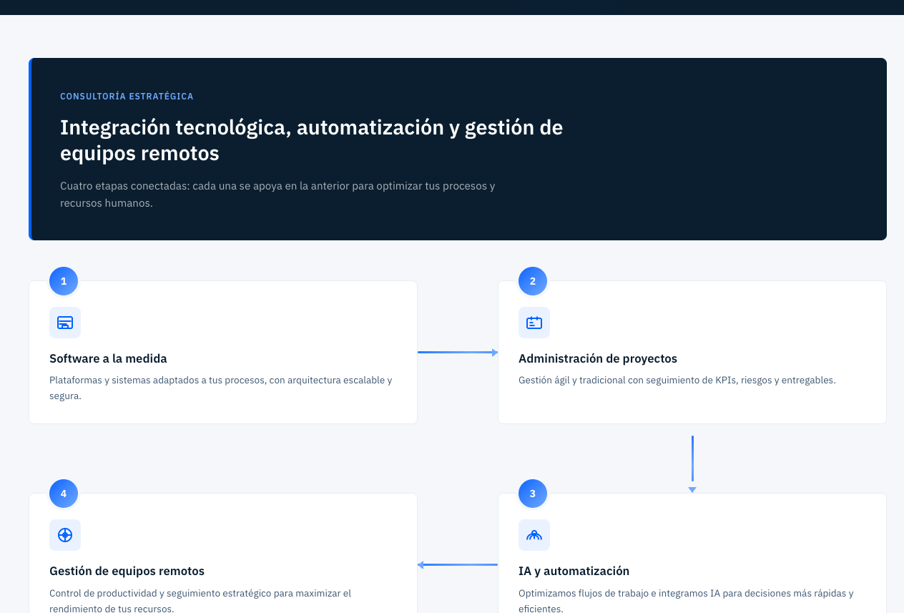
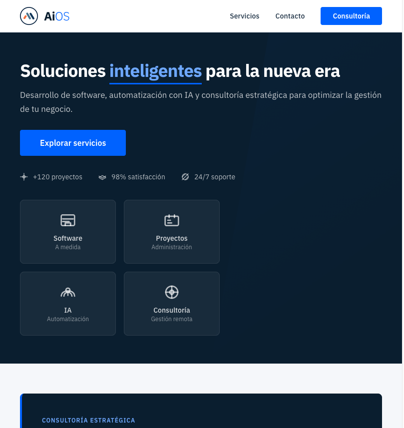
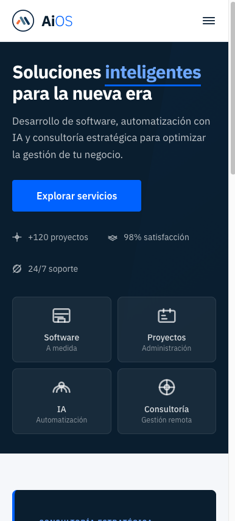
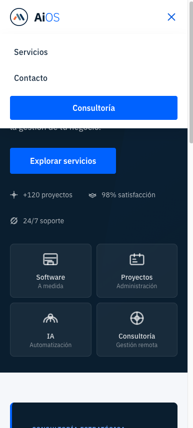

# AiOS · Landing page

Sitio de una sola página para **AiOS** — desarrollo de software, automatización con IA y
consultoría estratégica para la gestión de equipos remotos.

Construido con **Next.js 16** (App Router), **React 19** y **Tailwind CSS v4**. Todo son Server
Components salvo el header, que necesita cliente para el menú móvil y el scroll.

## Capturas

### Escritorio

Hero a dos columnas, con el bloque de capacidades a la derecha.



El camino de servicios serpentea en escritorio — `1 → 2`, baja por la derecha, `4 ← 3` — con
tramos animados que conectan cada etapa.



### Tablet

A partir de 768px el nav sigue completo, pero el hero pasa a una columna y las tarjetas se
reorganizan.



### Móvil

Una sola columna. Los enlaces del header se recogen tras el botón hamburguesa.

<p>
  
  
</p>

El menú se abre con animación y se cierra al elegir un elemento, con `Escape`, o al pasar a
escritorio.

## Puesta en marcha

```bash
npm install
npm run dev
```

Abre [http://localhost:3000](http://localhost:3000).

Otros comandos:

```bash
npm run build   # build de producción
npm run lint    # ESLint
```

## Estructura

```
app/
  layout.tsx          Fuente, metadatos, scroll suave
  page.tsx            Composición de la landing
  globals.css         Tokens del design system (@theme de Tailwind v4)
  icon.svg            Favicon; favicon.ico y apple-icon.png lo acompañan
  _components/        UI (el guion bajo la excluye del routing)
docs/screenshots/     Las imágenes de este README
.claude/skills/       Skill del design system
```

## Design system

Los tokens de color, tipografía, formas y animación viven en el bloque `@theme` de
`app/globals.css`. **No escribas valores de color literales en los componentes**: si necesitas
uno nuevo, añádelo primero como token.

La guía completa —incluidos los patrones de componente y las reglas de contraste— está en
`.claude/skills/design-system/SKILL.md`.

## Notas

- Tipografía **IBM Plex Sans**, servida localmente por `next/font`.
- La sección de contacto es solo maquetado: el CTA abre el cliente de correo, no hay backend.
- Los enlaces legales del footer son marcadores de posición.
- Las métricas del hero (+120 proyectos, 98% satisfacción) vienen del diseño original;
  conviene confirmarlas antes de publicar.
